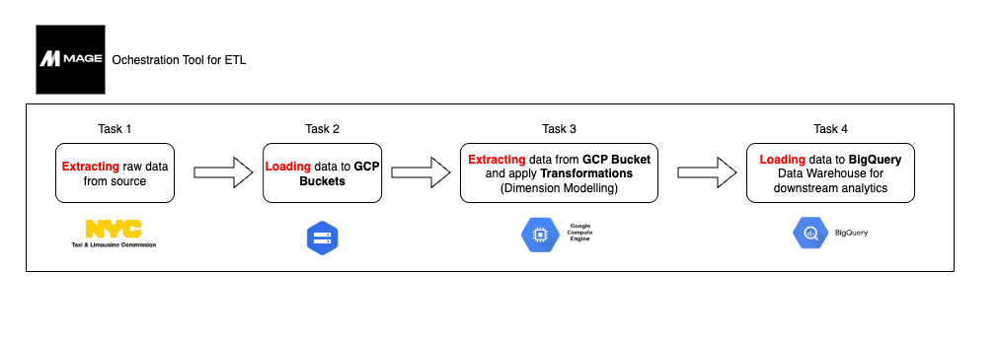
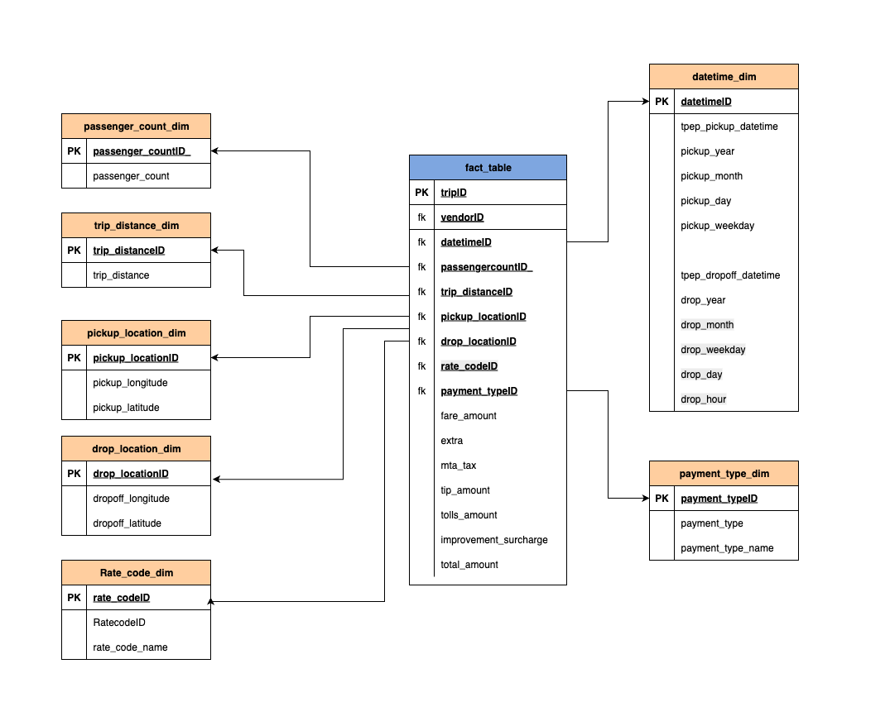
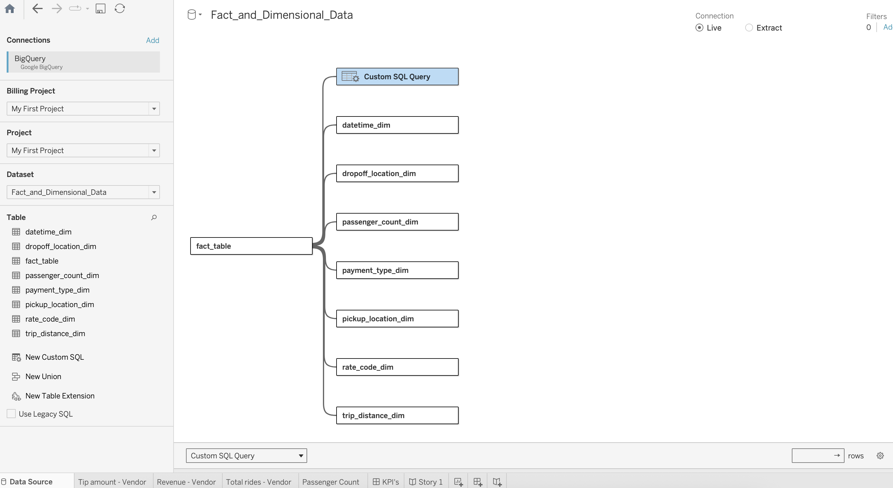
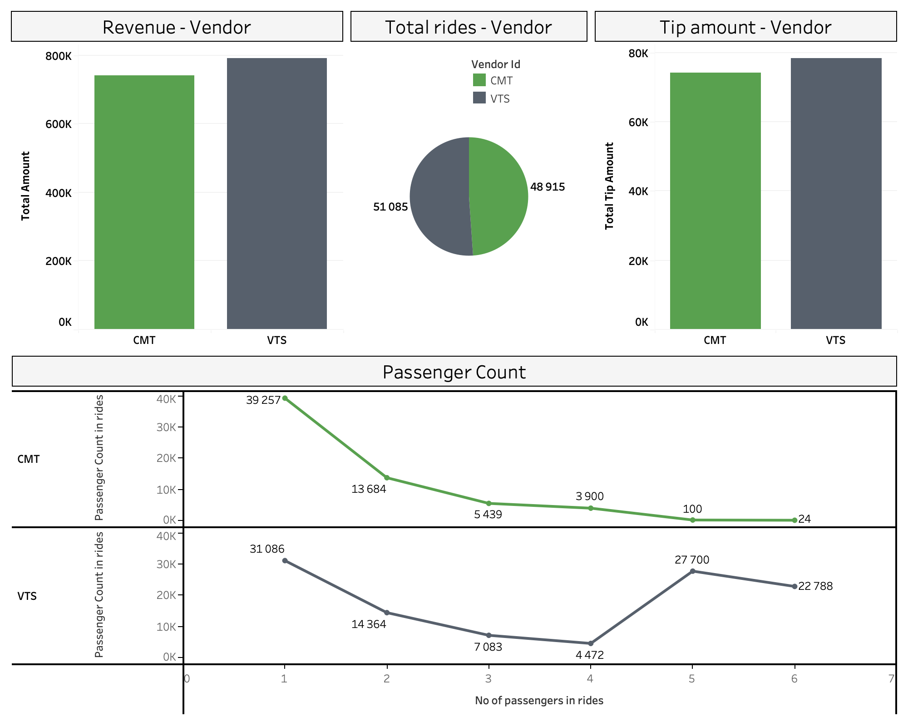

# 🚕 Uber Rides Data - ETL Pipeline 

The goal of this project is to build an ETL data pipeline on Cloud (GCP) services using Mage (orchestration tool).

## 🔎 Overview:

1. This project extracts ride data from the NYC API and loads it into GCP Buckets. 

2. Pulls data from the GCP bucket and transforms it into Fact and dimensional tables as required for a Data Warehouse. 

3. Finally, the transformed data is loaded into Google BigQuery and stored as a dataset.

## 📊 Dataset:

Source: NYC Open dataset. 

Size: ~100000 rows. 

### Dataset Columns

| Column Name              |

|--------------------------|

| VendorID                 |

| tpep_pickup_datetime     |

| tpep_dropoff_datetime    |

| passenger_count          |

| trip_distance            |

| pickup_longitude         |

| pickup_latitude          |

| RatecodeID               |

| store_and_fwd_flag       |

| dropoff_longitude        |

| dropoff_latitude         |

| payment_type             |

| fare_amount              |

| extra                    |

| mta_tax                  |

| tip_amount               |

| tolls_amount             |

| improvement_surcharge    |

| total_amount             |

| trip_id                  |

## 🔄 ETL Pipeline

🏗️ Architecture of the Pipeline:

Mage provides us with a Tree structure and visualizes how each component of the ETL pipeline connects. This makes it easier to understand the complete ETL process and spot when the pipeline breaks. The Mage UI for the ETL Tree is given below.

The whole ETL pipeline is orchestrated by Mage. It offers dedicated blocks to Extract (Data Loader), Transform (Transformer), and Load (Data Exporter) data from numerous sources and formats.

### Task 1: 

The data is pulled from the NYC API directly using the Data Loader. 

### Task 2:

The raw data received from the API is then loaded into GCP Buckets as CSV files. Bucket is a storage service that Google provides to store files in the Google cloud.

### Task 3:

This step transforms the data into Fact and Dimension tables. This is helpful when creating data warehouses for downstream analytics purposes. 

### The Start Schema for this warehouse is given below: 

### Task 4:

The Fact and Dimension tables are the result of the transformation for this pipeline. This transformed data is exported into Google BigQuery. BigQuery is a Data warehouse that GCP provides. With this step, the ETL pipeline completes. Further, we can connect the warehouse to BI tools like Tableau to run queries and create visualizations as per the business needs.

### Downstream Task:

Furthermore, we can use the data model dowstream to run analytics and build dashboards that are highly insighful to the stakeholders. I have created the dashboard below in Tableau for the dabout ETL pipeline as a downstream task. First I connect the BigQuery Warehouse with Tableau and then run custom queries to produce the below results. 

### Tableau Connection with Google BigQuery:

### Dashboard:

